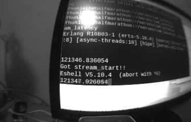
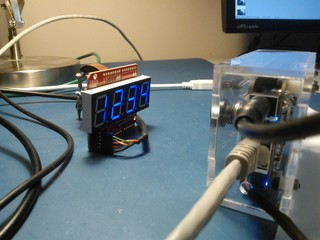
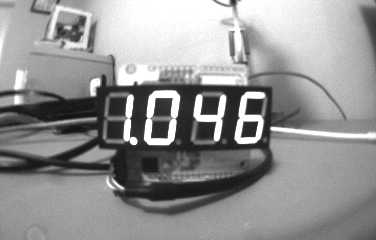

# Camera latency measurement

This is a really poor man's latency measurement tool to
quantify the "glass-to-glass" latency of the Erlang IP
camera setup. Glass-to-glass latency refers to
the time it takes light to hit the glass of the camera
and then be displayed on the screen. This program
measures that time indirectly by using the screen as
input to the camera and measuring how long it takes to
receive the result (but not display the result) over
the network.

To use the program, point the camera at the console where you're
going to run this program. When run, it will repeatedly
print the current time and capture frames from the camera.
Each frame is logged with the current time.
The total latency is then the difference between
the logged time and the time in the image.

For example, here's an example picture:

The time that the frame was received over HTTP was at
121347.131938. The time in the picture is 121347.026054,
so the latency is about 106 ms.

## Using a Sparkfun 7-segment display

It's also possible to use a Sparkfun 7-segment Arduino shield to
remove frame delays in the display path. LEDs are nice since they change
instantly. Connect a 5 V FTDI cable to the shield
and attach it to a USB port. Set the 7-segment display to run at
115200 baud (it defaults to 9600). Point the camera at the shield.
Here's my setup:

It might take some lighting adjustments to make sure that the LEDs
don't wash out. Setting the LED brightness to the lowest level helped
me get a decent picture with office lighting.

